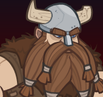

[Back to Main](index.md)

# Binwin

Binwin is unaffiliated and normally benefits from the following stat nodes:

{::nomarkdown}

{:/nomarkdown}
* Strength
* Constitution
* Charisma

{::nomarkdown}

{:/nomarkdown}

Binwin is a melee champion.

    
        **Stat Increasing Formation Abilities**
        
            
                
                    Binwin does not benefit from any stat increasing formation abilities.
                
            
        
        
            
                
                    <input type="checkbox" name="1" id="Feats to Spare" value="Feats to Spare">
                    <label for="Feats to Spare">Thellora: Feats to Spare</label>
                
            
                +1 Constitution
            
            
        
        
            
                
                    <input type="checkbox" name="5" id="Best And The Brightest" value="Best And The Brightest">
                    <label for="Best And The Brightest">Certainty: Best And The Brightest</label>
                
            
                +1 Intelligence
            
            
        
        
            
                
                    <input type="checkbox" name="5" id="Smooth Negotiators" value="Smooth Negotiators">
                    <label for="Smooth Negotiators">Certainty: Smooth Negotiators</label>
                
            
                +1 Charisma
            
            
        
    
{::nomarkdown}
    <a href="https://ic.byteglow.com/modron/dFFmh0JAwYRLfa9mH_uHt" target="_blank" data-core-id="6" data-buffs="">
{:/nomarkdown}
    
        
            Unaffiliated
        
        
            https://ic.byteglow.com/modron/dFFmh0JAwYRLfa9mH_uHt
        
        
            1.15e49%
        
    
{::nomarkdown}
    </a>
{:/nomarkdown}
{::nomarkdown}
    <a href="https://ic.byteglow.com/modron/T6WKqVL4iKEh9StNykvRh" target="_blank" data-core-id="2" data-buffs="">
{:/nomarkdown}
    
        
            Strong
        
        
            https://ic.byteglow.com/modron/T6WKqVL4iKEh9StNykvRh
        
        
            1.16e39%
        
    
{::nomarkdown}
    </a>
{:/nomarkdown}
{::nomarkdown}
    <a href="https://ic.byteglow.com/modron/8z5iuN2u8G544H6M8XcwL" target="_blank" data-core-id="1" data-buffs="">
{:/nomarkdown}
    
        
            Modest
        
        
            https://ic.byteglow.com/modron/8z5iuN2u8G544H6M8XcwL
        
        
            2.11e38%
        
    
{::nomarkdown}
    </a>
{:/nomarkdown}
{::nomarkdown}
    <a href="https://ic.byteglow.com/modron/GvRCQNy_OdugNFOjnqZZt" target="_blank" data-core-id="4" data-buffs="">
{:/nomarkdown}
    
        
            Magic (Non-Magic Variant)
        
        
            https://ic.byteglow.com/modron/GvRCQNy_OdugNFOjnqZZt
        
        
            1.04e37%
        
    
{::nomarkdown}
    </a>
{:/nomarkdown}

The Unaffiliated core is so far ahead of the other cores that it's really the only choice for Binwin.

Note that the damage of the Unaffiliated core varies depending on the number of unaffiliated champions in the formation. The damage numbers on the layout above account for just 1 (Binwin only). For a specific breakdown of how the core fares with more unaffiliated champions - check the table below.

| Core | Num Unaffiliated in Formation | Total Damage |
|---|---|---|
| Unaffiliated | 10 | 1.04e53% |
| Unaffiliated | 9 | 6.81e52% |
| Unaffiliated | 8 | 4.26e52% |
| Unaffiliated | 7 | 2.50e52% |
| Unaffiliated | 6 | 1.35e52% |
| Unaffiliated | 5 | 6.56e51% |
| Unaffiliated | 4 | 2.70e51% |
| Unaffiliated | 3 | 8.63e50% |
| Unaffiliated | 2 | 1.74e50% |
| Unaffiliated | 1 | 1.15e49% |

[Back to Top](#top)

*Last Modified: {{ site.time }}*
