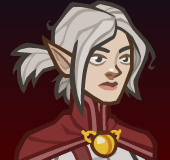

[Back to Main](index.md)

# Delina

Delina is in the Heroes of Baldur's Gate affiliation and benefits from the following stat nodes:

* Dexterity
* Constitution
* Intelligence
* Wisdom
* Charisma

Delina is a magic champion.

{::nomarkdown}
    <a href="https://ic.byteglow.com/modron/8euk6u6PKHy_mmNX4S7ek">
{:/nomarkdown}
    
        
            Magic
        
        
            https://ic.byteglow.com/modron/8euk6u6PKHy_mmNX4S7ek
        
        
            2.83e53%
        
    
{::nomarkdown}
    </a>
{:/nomarkdown}
{::nomarkdown}
    <a href="https://ic.byteglow.com/modron/I_8g095yWaHD-a-z3QeAJ">
{:/nomarkdown}
    
        
            Modest
        
        
            https://ic.byteglow.com/modron/I_8g095yWaHD-a-z3QeAJ
        
        
            2.18e42%
        
    
{::nomarkdown}
    </a>
{:/nomarkdown}
{::nomarkdown}
    <a href="https://ic.byteglow.com/modron/YAOozf3I19s8u67slvOgB">
{:/nomarkdown}
    
        
            Strong (Non-Melee Variant)
        
        
            https://ic.byteglow.com/modron/YAOozf3I19s8u67slvOgB
        
        
            1.90e41%
        
    
{::nomarkdown}
    </a>
{:/nomarkdown}

The Magic core is so far ahead of the other cores that it's really the only choice for Delina. Though it is worth noting that it doesn't have any health nodes.

[Back to Top](#top)

*Last Modified: {{ site.time }}*