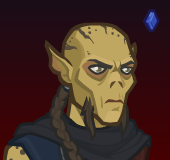

[Back to Main](index.md)

# Nrakk

Nrakk is unaffiliated and benefits from the following stat nodes:

* Strength
* Dexterity
* Constitution
* Intelligence (with Feat)
* Wisdom
* Charisma (with Feat)

Nrakk is a melee champion.

{::nomarkdown}
    <a href="https://ic.byteglow.com/modron/dFFmh0JAwYRLfa9mH_uHt" target="_blank">
{:/nomarkdown}
    
        
            Unaffiliated
        
        
            https://ic.byteglow.com/modron/dFFmh0JAwYRLfa9mH_uHt
        
        
            1.15e49%
        
    
{::nomarkdown}
    </a>
{:/nomarkdown}
{::nomarkdown}
    <a href="https://ic.byteglow.com/modron/UFBP5fZasLTvqf_bkqfx5" target="_blank">
{:/nomarkdown}
    
        
            Magic (Non-Magic Variant)
        
        
            https://ic.byteglow.com/modron/UFBP5fZasLTvqf_bkqfx5
        
        
            3.84e45%
        
    
{::nomarkdown}
    </a>
{:/nomarkdown}
{::nomarkdown}
    <a href="https://ic.byteglow.com/modron/b27B4yn_RIckxkXk_vYIp" target="_blank">
{:/nomarkdown}
    
        
            Strong
        
        
            https://ic.byteglow.com/modron/b27B4yn_RIckxkXk_vYIp
        
        
            3.09e45%
        
    
{::nomarkdown}
    </a>
{:/nomarkdown}
{::nomarkdown}
    <a href="https://ic.byteglow.com/modron/DkOJBZGdGpnq4_K4yQont" target="_blank">
{:/nomarkdown}
    
        
            Modest
        
        
            https://ic.byteglow.com/modron/DkOJBZGdGpnq4_K4yQont
        
        
            2.18e44%
        
    
{::nomarkdown}
    </a>
{:/nomarkdown}

The Unaffiliated core is far enough ahead of the other cores that it's the best one to use for Nrakk. That said - you could potentially use one of the other cores if the pipes you have favours one of them.

Note that the damage of the Unaffiliated core varies depending on the number of unaffiliated champions in the formation. The damage numbers on the layout above account for just 1 (Nrakk only). For a specific breakdown of how the core fares with more unaffiliated champions - check the table below.

| Core | Num Unaffiliated in Formation | Total Damage |
|---|---|---|
| Unaffiliated | 10 | 1.04e53% |
| Unaffiliated | 9 | 6.81e52% |
| Unaffiliated | 8 | 4.26e52% |
| Unaffiliated | 7 | 2.50e52% |
| Unaffiliated | 6 | 1.35e52% |
| Unaffiliated | 5 | 6.56e51% |
| Unaffiliated | 4 | 2.70e51% |
| Unaffiliated | 3 | 8.63e50% |
| Unaffiliated | 2 | 1.74e50% |
| Unaffiliated | 1 | 1.15e49% |

[Back to Top](#top)

*Last Modified: {{ site.time }}*