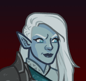

[Back to Main](index.md)

# Tatyana

Tatyana is in the Black Dice Society affiliation and normally benefits from the following stat nodes:

{::nomarkdown}

{:/nomarkdown}
* 13+ Strength
* 13+ Dexterity
* 13+ Constitution
* 13+ Wisdom
* 13+ Charisma (with Feat)

{::nomarkdown}

{:/nomarkdown}

Tatyana is a melee champion.

    
        **Stat Increasing Formation Abilities**
        
            
                
                    ??? does not gain the benefit of extra stat nodes from any stat increasing formation abilities.
                
            
        
        
            
                
                    <input type="checkbox" name="1" id="Feats to Spare" value="Feats to Spare">
                    <label for="Feats to Spare">Thellora: Feats to Spare</label>
                
            
                +1 Constitution
            
            
        
        
            
                
                    <input type="checkbox" name="5" id="Best And The Brightest" value="Best And The Brightest">
                    <label for="Best And The Brightest">Certainty: Best And The Brightest</label>
                
            
                +1 Intelligence
            
            
        
        
            
                
                    <input type="checkbox" name="5" id="Smooth Negotiators" value="Smooth Negotiators">
                    <label for="Smooth Negotiators">Certainty: Smooth Negotiators</label>
                
            
                +1 Charisma
            
            
        
        
            
                
                    <input type="checkbox" name="12" id="Wolf Pack" value="Wolf Pack">
                    <label for="Wolf Pack">Zorbu: Wolf Pack</label>
                
            
                +1 Dexterity
            
            
        
        
            
                
                    <input type="checkbox" name="2" id="Samurai Training" value="Samurai Training">
                    <label for="Samurai Training">Korth: Samurai Training</label>
                
            
                Set Dexterity to 16 (if lower)
            
            
        
    

There are no viable cores for Tatyana.

[Back to Top](#top)

*Last Modified: {{ site.time }}*
