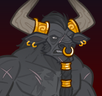

[Back to Main](index.md)

# Torogar

Torogar is in the Dark Order affiliation and benefits from the following stat nodes:

* Strength
* Dexterity
* Constitution
* Charisma

Torogar is a melee champion.

{::nomarkdown}
    <a href="https://ic.byteglow.com/modron/Gp0kNQ05tR2pJtzgovLKe">
{:/nomarkdown}
    
        
            Strong
        
        
            https://ic.byteglow.com/modron/Gp0kNQ05tR2pJtzgovLKe
        
        
            1.68e41%
        
    
{::nomarkdown}
    </a>
{:/nomarkdown}
{::nomarkdown}
    <a href="https://ic.byteglow.com/modron/Z3dqepoGNtSI25cJzrPbj">
{:/nomarkdown}
    
        
            Modest
        
        
            https://ic.byteglow.com/modron/Z3dqepoGNtSI25cJzrPbj
        
        
            3.05e40%
        
    
{::nomarkdown}
    </a>
{:/nomarkdown}

The listed cores are all similar enough in damage for Torogar that you should use whichever you have the more favourable pipes for.

The Magic core has not been included because it would be missing too many nodes to be a viable choice.

[Back to Top](#top)

*Last Modified: {{ site.time }}*