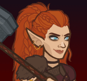

[Back to Main](index.md)

# Aila

Aila is in the Heroes of Aerois affiliation, Chaotic Neutral and normally benefits from the following stat nodes:

{::nomarkdown}

{:/nomarkdown}
* 13+ Strength
* 13+ Dexterity
* 15+ Dexterity
* 13+ Constitution
* 13+ Wisdom

{::nomarkdown}

{:/nomarkdown}

Aila is a melee champion.

    
        **Stat Increasing Formation Abilities**
        
            
                
                    Aila does not gain the benefit of extra stat nodes from any stat increasing formation abilities.
                
            
        
        
            
                
                    <input type="checkbox" name="1" id="Feats to Spare" value="Feats to Spare">
                    <label for="Feats to Spare">Thellora: Feats to Spare</label>
                
            
                +1 Constitution
            
            
                +2 Intelligence
            
            
        
        
            
                
                    <input type="checkbox" name="3" id="Circle Magic" value="Circle Magic">
                    <label for="Circle Magic">Dynaheir: Circle Magic</label>
                
            
                +2 Constitution
            
            
        
        
            
                
                    <input type="checkbox" name="4" id="Witch's Switch" value="Witch's Switch">
                    <label for="Witch's Switch">Skylla: Witch's Switch</label>
                
            
                Swap Strength and Charisma
            
            
                Swap Dexterity and Intelligence
            
            
                Swap Constitution and Wisdom
            
            
        
        
            
                
                    <input type="checkbox" name="5" id="Best And The Brightest" value="Best And The Brightest">
                    <label for="Best And The Brightest">Certainty: Best And The Brightest</label>
                
            
                +2 Intelligence
            
            
        
        
            
                
                    <input type="checkbox" name="5" id="Smooth Negotiators" value="Smooth Negotiators">
                    <label for="Smooth Negotiators">Certainty: Smooth Negotiators</label>
                
            
                +2 Charisma
            
            
        
        
            
                
                    <input type="checkbox" name="12" id="Wolf Pack" value="Wolf Pack">
                    <label for="Wolf Pack">Zorbu: Wolf Pack</label>
                
            
                +1 Dexterity
            
            
        
        
            
                
                    <input type="checkbox" name="2" id="Samurai Training" value="Samurai Training">
                    <label for="Samurai Training">Korth: Samurai Training</label>
                
            
                Set Dexterity to 16 (if lower)
            
            
        
    
{::nomarkdown}
    <a href="https://ic.byteglow.com/modron/W08yr0Hrmfq2J9qzZGRaB" target="_blank" data-core-id="7" data-buffs="">
{:/nomarkdown}
    
        
            Dexterous
        
        
            ic.byteglow.com/modron/W08yr0Hrmfq2J9qzZGRaB
        
        
            1.15e49%
        
        
            This core can potentially do more damage. See the link to the Variable Core Damage Information tab for details.
        
    
{::nomarkdown}
    </a>
{:/nomarkdown}
{::nomarkdown}
    <a href="https://ic.byteglow.com/modron/UFBP5fZasLTvqf_bkqfx5" target="_blank" data-core-id="4" data-buffs="Witch's Switch" hidden>
{:/nomarkdown}
    
        
            Magic (Non-Magic Variant)
        
        
            ic.byteglow.com/modron/UFBP5fZasLTvqf_bkqfx5
        
        
            3.84e45%
        
    
{::nomarkdown}
    </a>
{:/nomarkdown}
{::nomarkdown}
    <a href="https://ic.byteglow.com/modron/NiGSGsacHW4McSTThGhaB" target="_blank" data-core-id="2" data-buffs="Feats to Spare,Best And The Brightest" hidden>
{:/nomarkdown}
    
        
            Strong
        
        
            ic.byteglow.com/modron/NiGSGsacHW4McSTThGhaB
        
        
            3.09e45%
        
    
{::nomarkdown}
    </a>
{:/nomarkdown}
{::nomarkdown}
    <a href="https://ic.byteglow.com/modron/jRrxHkBW6rSGswR7YGk6c" target="_blank" data-core-id="2" data-buffs="Witch's Switch,Samurai Training" hidden>
{:/nomarkdown}
    
        
            Strong
        
        
            ic.byteglow.com/modron/jRrxHkBW6rSGswR7YGk6c
        
        
            2.13e43%
        
    
{::nomarkdown}
    </a>
{:/nomarkdown}
{::nomarkdown}
    <a href="https://ic.byteglow.com/modron/HRzw-pCS165T9h4HkWt92" target="_blank" data-core-id="2" data-buffs="">
{:/nomarkdown}
    
        
            Strong
        
        
            ic.byteglow.com/modron/HRzw-pCS165T9h4HkWt92
        
        
            2.13e43%
        
    
{::nomarkdown}
    </a>
{:/nomarkdown}
{::nomarkdown}
    <a href="https://ic.byteglow.com/modron/e6umTlPdyPUKREqV7MwEw" target="_blank" data-core-id="1" data-buffs="Feats to Spare,Best And The Brightest" hidden>
{:/nomarkdown}
    
        
            Modest
        
        
            ic.byteglow.com/modron/e6umTlPdyPUKREqV7MwEw
        
        
            2.99e42%
        
    
{::nomarkdown}
    </a>
{:/nomarkdown}
{::nomarkdown}
    <a href="https://ic.byteglow.com/modron/I_8g095yWaHD-a-z3QeAJ" target="_blank" data-core-id="1" data-buffs="Witch's Switch,Samurai Training" hidden>
{:/nomarkdown}
    
        
            Modest
        
        
            ic.byteglow.com/modron/I_8g095yWaHD-a-z3QeAJ
        
        
            2.18e42%
        
    
{::nomarkdown}
    </a>
{:/nomarkdown}
{::nomarkdown}
    <a href="https://ic.byteglow.com/modron/Y-dm5dFF-poiLBflC5f17" target="_blank" data-core-id="4" data-buffs="Feats to Spare,Best And The Brightest" hidden>
{:/nomarkdown}
    
        
            Magic (Non-Magic Variant)
        
        
            ic.byteglow.com/modron/Y-dm5dFF-poiLBflC5f17
        
        
            1.91e41%
        
    
{::nomarkdown}
    </a>
{:/nomarkdown}
{::nomarkdown}
    <a href="https://ic.byteglow.com/modron/YlXah8IX9XopbQGdKtvRm" target="_blank" data-core-id="2" data-buffs="Witch's Switch" hidden>
{:/nomarkdown}
    
        
            Strong
        
        
            ic.byteglow.com/modron/YlXah8IX9XopbQGdKtvRm
        
        
            1.47e41%
        
    
{::nomarkdown}
    </a>
{:/nomarkdown}
{::nomarkdown}
    <a href="https://ic.byteglow.com/modron/mowHXKsW2fxXBH2ZfKwFi" target="_blank" data-core-id="1" data-buffs="">
{:/nomarkdown}
    
        
            Modest
        
        
            ic.byteglow.com/modron/mowHXKsW2fxXBH2ZfKwFi
        
        
            2.07e40%
        
    
{::nomarkdown}
    </a>
{:/nomarkdown}
{::nomarkdown}
    <a href="https://ic.byteglow.com/modron/GVzF80oaJtc0Nm_DA9Mko" target="_blank" data-core-id="1" data-buffs="Witch's Switch" hidden>
{:/nomarkdown}
    
        
            Modest
        
        
            ic.byteglow.com/modron/GVzF80oaJtc0Nm_DA9Mko
        
        
            1.50e40%
        
    
{::nomarkdown}
    </a>
{:/nomarkdown}
{::nomarkdown}
    <a href="https://ic.byteglow.com/modron/y9CoTUR3HQcKJ9AATFo2L" target="_blank" data-core-id="4" data-buffs="">
{:/nomarkdown}
    
        
            Magic (Non-Magic Variant)
        
        
            ic.byteglow.com/modron/y9CoTUR3HQcKJ9AATFo2L
        
        
            9.06e36%
        
    
{::nomarkdown}
    </a>
{:/nomarkdown}

The Dexterous core is so far ahead of the Strong core that it's really the only choice for Aila.

Remember that the Dexterous Core has variable damage. Please see the [Variable Core Damage Information](/#variablesTab){:target="_blank"} tab for more detailed information.

[Back to Top](#top)

*Last Modified: {{ site.time }}*
