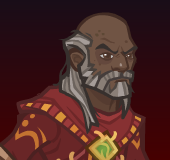

[Back to Main](index.md)

# Dhadius

Dhadius is unaffiliated and normally benefits from the following stat nodes:

{::nomarkdown}

{:/nomarkdown}
* 13+ Intelligence

{::nomarkdown}

{:/nomarkdown}

Dhadius is a magic champion.

    
        **Stat Increasing Formation Abilities**
        
            
                
                    Dhadius does not gain the benefit of extra stat nodes from any stat increasing formation abilities.
                
            
        
        
            
                
                    <input type="checkbox" name="1" id="Feats to Spare" value="Feats to Spare">
                    <label for="Feats to Spare">Thellora: Feats to Spare</label>
                
            
                +1 Constitution
            
            
                +2 Intelligence
            
            
        
        
            
                
                    <input type="checkbox" name="3" id="Circle Magic" value="Circle Magic">
                    <label for="Circle Magic">Dynaheir: Circle Magic</label>
                
            
                +2 Constitution
            
            
        
        
            
                
                    <input type="checkbox" name="5" id="Best And The Brightest" value="Best And The Brightest">
                    <label for="Best And The Brightest">Certainty: Best And The Brightest</label>
                
            
                +2 Intelligence
            
            
        
        
            
                
                    <input type="checkbox" name="5" id="Smooth Negotiators" value="Smooth Negotiators">
                    <label for="Smooth Negotiators">Certainty: Smooth Negotiators</label>
                
            
                +2 Charisma
            
            
        
        
            
                
                    <input type="checkbox" name="12" id="Wolf Pack" value="Wolf Pack">
                    <label for="Wolf Pack">Zorbu: Wolf Pack</label>
                
            
                +1 Dexterity
            
            
        
        
            
                
                    <input type="checkbox" name="2" id="Samurai Training" value="Samurai Training">
                    <label for="Samurai Training">Korth: Samurai Training</label>
                
            
                Set Dexterity to 16 (if lower)
            
            
        
    
{::nomarkdown}
    <a href="https://ic.byteglow.com/modron/dFFmh0JAwYRLfa9mH_uHt" target="_blank" data-core-id="6" data-buffs="">
{:/nomarkdown}
    
        
            Unaffiliated
        
        
            ic.byteglow.com/modron/dFFmh0JAwYRLfa9mH_uHt
        
        
            1.15e49%
        
        
            This core can potentially do more damage. See the damage table(s) below for details.
        
    
{::nomarkdown}
    </a>
{:/nomarkdown}
{::nomarkdown}
    <a href="https://ic.byteglow.com/modron/W08yr0Hrmfq2J9qzZGRaB" target="_blank" data-core-id="7" data-buffs="Samurai Training" hidden>
{:/nomarkdown}
    
        
            Dexterous
        
        
            ic.byteglow.com/modron/W08yr0Hrmfq2J9qzZGRaB
        
        
            1.15e49%
        
        
            This core can potentially do more damage. See the damage table(s) below for details.
        
    
{::nomarkdown}
    </a>
{:/nomarkdown}
{::nomarkdown}
    <a href="https://ic.byteglow.com/modron/POqxrC8GsE2yuyH32qVs8" target="_blank" data-core-id="4" data-buffs="">
{:/nomarkdown}
    
        
            Magic
        
        
            ic.byteglow.com/modron/POqxrC8GsE2yuyH32qVs8
        
        
            1.20e45%
        
    
{::nomarkdown}
    </a>
{:/nomarkdown}
{::nomarkdown}
    <a href="https://ic.byteglow.com/modron/t5N5een-w8gjhTS37X0Kf" target="_blank" data-core-id="2" data-buffs="Feats to Spare,Circle Magic,Samurai Training" hidden>
{:/nomarkdown}
    
        
            Strong (Non-Melee Variant)
        
        
            ic.byteglow.com/modron/t5N5een-w8gjhTS37X0Kf
        
        
            1.39e39%
        
    
{::nomarkdown}
    </a>
{:/nomarkdown}
{::nomarkdown}
    <a href="https://ic.byteglow.com/modron/t5N5een-w8gjhTS37X0Kf" target="_blank" data-core-id="2" data-buffs="Feats to Spare,Circle Magic,Wolf Pack" hidden>
{:/nomarkdown}
    
        
            Strong (Non-Melee Variant)
        
        
            ic.byteglow.com/modron/t5N5een-w8gjhTS37X0Kf
        
        
            1.39e39%
        
    
{::nomarkdown}
    </a>
{:/nomarkdown}
{::nomarkdown}
    <a href="https://ic.byteglow.com/modron/U8o2y_ATayNDoUuHJPc3q" target="_blank" data-core-id="1" data-buffs="Feats to Spare,Circle Magic,Samurai Training" hidden>
{:/nomarkdown}
    
        
            Modest
        
        
            ic.byteglow.com/modron/U8o2y_ATayNDoUuHJPc3q
        
        
            2.57e38%
        
    
{::nomarkdown}
    </a>
{:/nomarkdown}
{::nomarkdown}
    <a href="https://ic.byteglow.com/modron/U8o2y_ATayNDoUuHJPc3q" target="_blank" data-core-id="1" data-buffs="Feats to Spare,Circle Magic,Wolf Pack" hidden>
{:/nomarkdown}
    
        
            Modest
        
        
            ic.byteglow.com/modron/U8o2y_ATayNDoUuHJPc3q
        
        
            2.57e38%
        
    
{::nomarkdown}
    </a>
{:/nomarkdown}
{::nomarkdown}
    <a href="https://ic.byteglow.com/modron/MOgrRfFbXjmIBuNZu3_1L" target="_blank" data-core-id="2" data-buffs="Feats to Spare,Circle Magic" hidden>
{:/nomarkdown}
    
        
            Strong (Non-Melee Variant)
        
        
            ic.byteglow.com/modron/MOgrRfFbXjmIBuNZu3_1L
        
        
            9.45e36%
        
    
{::nomarkdown}
    </a>
{:/nomarkdown}
{::nomarkdown}
    <a href="https://ic.byteglow.com/modron/BoKzBuQQ_gwJbctPbz0FM" target="_blank" data-core-id="2" data-buffs="Samurai Training" hidden>
{:/nomarkdown}
    
        
            Strong (Non-Melee Variant)
        
        
            ic.byteglow.com/modron/BoKzBuQQ_gwJbctPbz0FM
        
        
            9.45e36%
        
    
{::nomarkdown}
    </a>
{:/nomarkdown}
{::nomarkdown}
    <a href="https://ic.byteglow.com/modron/BoKzBuQQ_gwJbctPbz0FM" target="_blank" data-core-id="2" data-buffs="Wolf Pack" hidden>
{:/nomarkdown}
    
        
            Strong (Non-Melee Variant)
        
        
            ic.byteglow.com/modron/BoKzBuQQ_gwJbctPbz0FM
        
        
            9.45e36%
        
    
{::nomarkdown}
    </a>
{:/nomarkdown}
{::nomarkdown}
    <a href="https://ic.byteglow.com/modron/DsVh4JSKxCnsYuKIstsHI" target="_blank" data-core-id="1" data-buffs="Samurai Training" hidden>
{:/nomarkdown}
    
        
            Modest
        
        
            ic.byteglow.com/modron/DsVh4JSKxCnsYuKIstsHI
        
        
            2.32e36%
        
    
{::nomarkdown}
    </a>
{:/nomarkdown}
{::nomarkdown}
    <a href="https://ic.byteglow.com/modron/DsVh4JSKxCnsYuKIstsHI" target="_blank" data-core-id="1" data-buffs="Wolf Pack" hidden>
{:/nomarkdown}
    
        
            Modest
        
        
            ic.byteglow.com/modron/DsVh4JSKxCnsYuKIstsHI
        
        
            2.32e36%
        
    
{::nomarkdown}
    </a>
{:/nomarkdown}
{::nomarkdown}
    <a href="https://ic.byteglow.com/modron/4CdqOAEO34lRRIVb9UzV5" target="_blank" data-core-id="1" data-buffs="Feats to Spare,Circle Magic" hidden>
{:/nomarkdown}
    
        
            Modest
        
        
            ic.byteglow.com/modron/4CdqOAEO34lRRIVb9UzV5
        
        
            1.77e36%
        
    
{::nomarkdown}
    </a>
{:/nomarkdown}
{::nomarkdown}
    <a href="https://ic.byteglow.com/modron/aWlgIBvGaXLpMnox7F8zh" target="_blank" data-core-id="2" data-buffs="">
{:/nomarkdown}
    
        
            Strong (Non-Melee Variant)
        
        
            ic.byteglow.com/modron/aWlgIBvGaXLpMnox7F8zh
        
        
            6.52e34%
        
    
{::nomarkdown}
    </a>
{:/nomarkdown}
{::nomarkdown}
    <a href="https://ic.byteglow.com/modron/O7kCMROWNQtSTcqCpprEe" target="_blank" data-core-id="1" data-buffs="">
{:/nomarkdown}
    
        
            Modest
        
        
            ic.byteglow.com/modron/O7kCMROWNQtSTcqCpprEe
        
        
            1.60e34%
        
    
{::nomarkdown}
    </a>
{:/nomarkdown}

The Unaffiliated core is far enough ahead of the Magic core that it's the best one to use for Dhadius. I do not recommend even trying the Magic core because it doesn't have any health nodes.

{::nomarkdown}

{:/nomarkdown}

Note that the damage of the Unaffiliated and Dexterous cores vary depending on the number of unaffiliated or 15+ Dexterity champions (respectively) in the formation. The damage numbers on the layout above account for just 1 (Dhadius only). For a specific breakdown of how the cores fare with more unaffiliated or 15+ Dexterity champions - check the tables below.

| Core | Num Unaffiliated in Formation | Total Damage | | Core | Num 15+ Dex in Formation | Total Damage |
|---|---|---|---|---|---|---|
| Unaffiliated | 10 | 1.04e53% | | Dexterous | 10 | 1.04e53% |
| Unaffiliated | 9 | 6.81e52% | | Dexterous | 9 | 6.81e52% |
| Unaffiliated | 8 | 4.26e52% | | Dexterous | 8 | 4.26e52% |
| Unaffiliated | 7 | 2.50e52% | | Dexterous | 7 | 2.50e52% |
| Unaffiliated | 6 | 1.35e52% | | Dexterous | 6 | 1.35e52% |
| Unaffiliated | 5 | 6.56e51% | | Dexterous | 5 | 6.56e51% |
| Unaffiliated | 4 | 2.70e51% | | Dexterous | 4 | 2.70e51% |
| Unaffiliated | 3 | 8.63e50% | | Dexterous | 3 | 8.63e50% |
| Unaffiliated | 2 | 1.74e50% | | Dexterous | 2 | 1.74e50% |
| Unaffiliated | 1 | 1.15e49% | | Dexterous | 1 | 1.15e49% |

{::nomarkdown}

{:/nomarkdown}

Note that the damage of the Unaffiliated core varies depending on the number of unaffiliated champions in the formation. The damage numbers on the layout above account for just 1 (Dhadius only). For a specific breakdown of how the core fares with more unaffiliated champions - check the table below.

| Core | Num Unaffiliated in Formation | Total Damage |
|---|---|---|
| Unaffiliated | 10 | 1.04e53% |
| Unaffiliated | 9 | 6.81e52% |
| Unaffiliated | 8 | 4.26e52% |
| Unaffiliated | 7 | 2.50e52% |
| Unaffiliated | 6 | 1.35e52% |
| Unaffiliated | 5 | 6.56e51% |
| Unaffiliated | 4 | 2.70e51% |
| Unaffiliated | 3 | 8.63e50% |
| Unaffiliated | 2 | 1.74e50% |
| Unaffiliated | 1 | 1.15e49% |

{::nomarkdown}

{:/nomarkdown}

[Back to Top](#top)

*Last Modified: {{ site.time }}*
