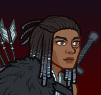

[Back to Main](index.md)

# Solaak

Solaak is unaffiliated and normally benefits from the following stat nodes:

{::nomarkdown}

{:/nomarkdown}
* 13+ Strength
* 13+ Dexterity
* 15+ Dexterity
* 13+ Constitution
* 13+ Intelligence
* 13+ Wisdom
* 13+ Charisma

{::nomarkdown}

{:/nomarkdown}

Solaak is a ranged champion.

    
        **Stat Increasing Formation Abilities**
        
            
                
                    Solaak does not gain the benefit of extra stat nodes from any stat increasing formation abilities.
                
            
        
        
            
                
                    <input type="checkbox" name="1" id="Feats to Spare" value="Feats to Spare">
                    <label for="Feats to Spare">Thellora: Feats to Spare</label>
                
            
                +1 Constitution
            
            
        
        
            
                
                    <input type="checkbox" name="5" id="Best And The Brightest" value="Best And The Brightest">
                    <label for="Best And The Brightest">Certainty: Best And The Brightest</label>
                
            
                +1 Intelligence
            
            
        
        
            
                
                    <input type="checkbox" name="5" id="Smooth Negotiators" value="Smooth Negotiators">
                    <label for="Smooth Negotiators">Certainty: Smooth Negotiators</label>
                
            
                +1 Charisma
            
            
        
        
            
                
                    <input type="checkbox" name="12" id="Wolf Pack" value="Wolf Pack">
                    <label for="Wolf Pack">Zorbu: Wolf Pack</label>
                
            
                +1 Dexterity
            
            
        
        
            
                
                    <input type="checkbox" name="2" id="Samurai Training" value="Samurai Training">
                    <label for="Samurai Training">Korth: Samurai Training</label>
                
            
                Set Dexterity to 16 (if lower)
            
            
        
    
{::nomarkdown}
    <a href="https://ic.byteglow.com/modron/dFFmh0JAwYRLfa9mH_uHt" target="_blank" data-core-id="6" data-buffs="">
{:/nomarkdown}
    
        
            Unaffiliated
        
        
            https://ic.byteglow.com/modron/dFFmh0JAwYRLfa9mH_uHt
        
        
            1.15e49%
        
    
{::nomarkdown}
    </a>
{:/nomarkdown}
{::nomarkdown}
    <a href="https://ic.byteglow.com/modron/7114GoDxPsVq9PvgtiUYx" target="_blank" data-core-id="7" data-buffs="">
{:/nomarkdown}
    
        
            Dexterous
        
        
            https://ic.byteglow.com/modron/7114GoDxPsVq9PvgtiUYx
        
        
            1.15e49%
        
    
{::nomarkdown}
    </a>
{:/nomarkdown}
{::nomarkdown}
    <a href="https://ic.byteglow.com/modron/UFBP5fZasLTvqf_bkqfx5" target="_blank" data-core-id="4" data-buffs="">
{:/nomarkdown}
    
        
            Magic (Non-Magic Variant)
        
        
            https://ic.byteglow.com/modron/UFBP5fZasLTvqf_bkqfx5
        
        
            3.84e45%
        
    
{::nomarkdown}
    </a>
{:/nomarkdown}
{::nomarkdown}
    <a href="https://ic.byteglow.com/modron/DkOJBZGdGpnq4_K4yQont" target="_blank" data-core-id="1" data-buffs="">
{:/nomarkdown}
    
        
            Modest
        
        
            https://ic.byteglow.com/modron/DkOJBZGdGpnq4_K4yQont
        
        
            2.18e44%
        
    
{::nomarkdown}
    </a>
{:/nomarkdown}
{::nomarkdown}
    <a href="https://ic.byteglow.com/modron/cIBAzt8UjhSQY1gj6MW1g" target="_blank" data-core-id="2" data-buffs="">
{:/nomarkdown}
    
        
            Strong (Non-Melee Variant)
        
        
            https://ic.byteglow.com/modron/cIBAzt8UjhSQY1gj6MW1g
        
        
            2.76e43%
        
    
{::nomarkdown}
    </a>
{:/nomarkdown}

The Unaffiliated and Dexterous cores are far enough ahead of the other cores that they are the best ones to use for Solaak. That said - you could potentially use one of the other cores if the pipes you have favours one of them.

Note that the damage of the Unaffiliated and Dexterous cores vary depending on the number of unaffiliated or 15+ Dexterity champions (respectively) in the formation. The damage numbers on the layout above account for just 1 (Solaak only). For a specific breakdown of how the cores fare with more unaffiliated or 15+ Dexterity champions - check the tables below.

| Core | Num Unaffiliated in Formation | Total Damage | | Core | Num 15+ Dex in Formation | Total Damage |
|---|---|---|---|---|---|---|
| Unaffiliated | 10 | 1.04e53% | | Dexterous | 10 | 1.04e53% |
| Unaffiliated | 9 | 6.81e52% | | Dexterous | 9 | 6.81e52% |
| Unaffiliated | 8 | 4.26e52% | | Dexterous | 8 | 4.26e52% |
| Unaffiliated | 7 | 2.50e52% | | Dexterous | 7 | 2.50e52% |
| Unaffiliated | 6 | 1.35e52% | | Dexterous | 6 | 1.35e52% |
| Unaffiliated | 5 | 6.56e51% | | Dexterous | 5 | 6.56e51% |
| Unaffiliated | 4 | 2.70e51% | | Dexterous | 4 | 2.70e51% |
| Unaffiliated | 3 | 8.63e50% | | Dexterous | 3 | 8.63e50% |
| Unaffiliated | 2 | 1.74e50% | | Dexterous | 2 | 1.74e50% |
| Unaffiliated | 1 | 1.15e49% | | Dexterous | 1 | 1.15e49% |

[Back to Top](#top)

*Last Modified: {{ site.time }}*
